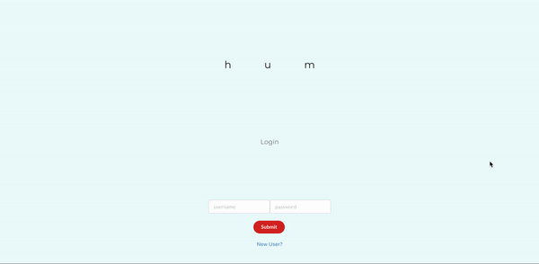
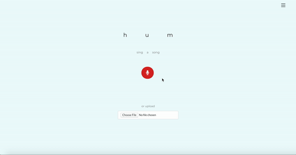
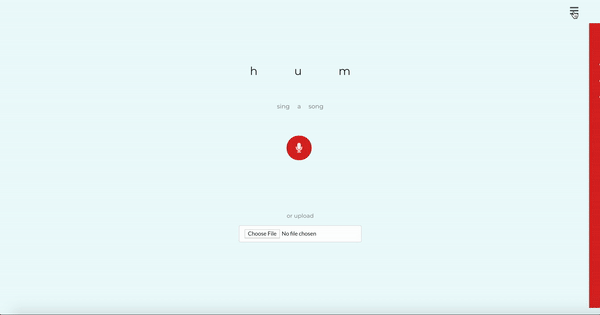

<b>HUM</b>

[humsomething.netlify.com](http://humsomething.netlify.com)

Hum is a single page application for those of us who can only remember melodies.
Hum takes audio input from the user and returns a matching song title, lyrics, artist,  and YouTube link.

--------------

Before running hum, the user must:

npm install

then

npm start

<b>Login and Registration</b>

When launching Hum, the user will be brought to a login page and will be prompted to either login or signup.

<b>Dashboard</b>

After logging into Hum, the user will see a large record button in the center of the page and a hamburger button on the top right corner. Given the user wants to hum a song, the record button can be clicked, a notification will appear for the user to approve the use of a microphone in the browser, and audio input can be captured. The user can then click the button again to stop recording and wait for results to populate. The user can view the results and either dismiss or save the song information.

----------------

<b>Viewing Song Details and CRUD Functionality</b>

When viewing the song details, the user can view the lyrics, title, name of artist, and YouTube link for the found song. There is also a field for which the user can choose to enter a comment about the song. The user can input these comments before saving and/or when viewing and editing previously saved songs. The user has the option view, edit, or delete any previously saved song from the collapsible sidebar view.

----------------

<b>Uploading Recording Instead of Humming</b>

The user has the option to choose a previously recorded file instead of humming live. This recording is then processed in the same way as a live input. 

------------------
Hum is built using:

React.js / 
Semantic UI React / 
Firebase / 
AudD Api / 
YouTube Data Api / 
MediaRecorder Api
